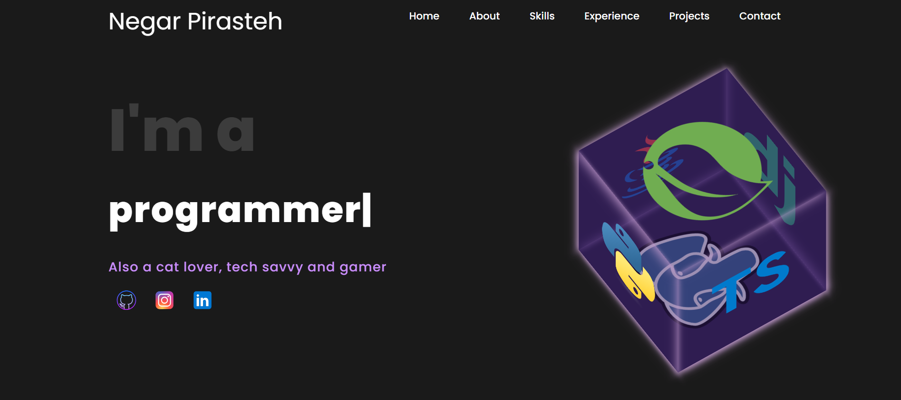
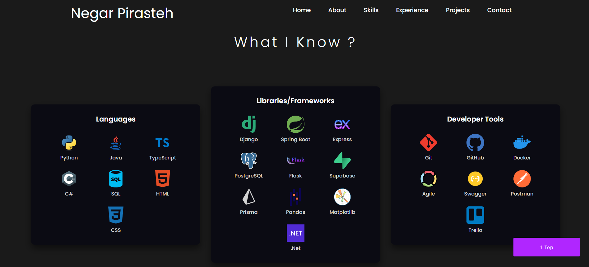
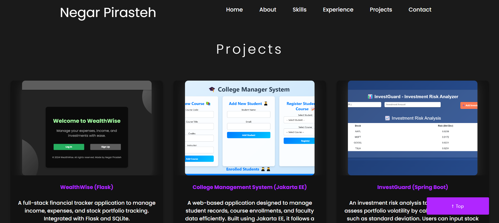

# **Personal Portfolio Website**

Welcome to my personal portfolio repository! 🚀 This project showcases my skills, projects, and passion for web development. The portfolio is designed to be clean, modern, and responsive, highlighting my journey as a developer and allowing visitors to connect with me directly.

🔗 **Live Demo**: [Portfolio](https://negarprh.github.io/Portfolio/)

---

## **🌟 Features**
- **About Me Section:** Learn about my background, experience, and skills.
- **Projects Showcase:** Explore my completed projects with links to live demos and GitHub repositories.
- **Blog Section:** Stay updated with my latest blogs and tech insights.
- **Contact Me:** A functional contact form for visitors to send inquiries directly.

---

## **🖼️ Screenshots**
### Homepage


### Skills


### Projects Section


### Contact Me


---

## **💻 Tech Stack**
- **Frontend:** 
  - HTML5
  - CSS3 (Flexbox, Grid)
  - JavaScript (Interactive Features)
- **Styling Frameworks & Tools:** Bootstrap
- **Animations:** ScrollReveal.js

---

## **📂 Project Structure**
```
├── assets/
│   ├── css/                # Stylesheets
│   ├── images/             # Images used in the project
│   ├── js/                 # JavaScript files
├── index.html              # Main HTML file
├── README.md               # Project description
```

---

## **🌐 Live Demo**
Check out the live version of the portfolio: [Portfolio](https://negarprh.github.io/Portfolio/)

---

## **💌 Connect With Me**
Feel free to reach out or connect:
- **LinkedIn:** [Negar Pirasteh](https://www.linkedin.com/in/negar-pirasteh/)
- **GitHub:** [negarprh](https://github.com/negarprh)
- **Instagram:** [@negar_tech](https://www.instagram.com/negar_tech/)

---

## **📜 License**
This project is licensed under the MIT License - see the [LICENSE](LICENSE) file for details.

---

### **✨ Special Thanks**
- To all the amazing developers and designers who inspired me.
